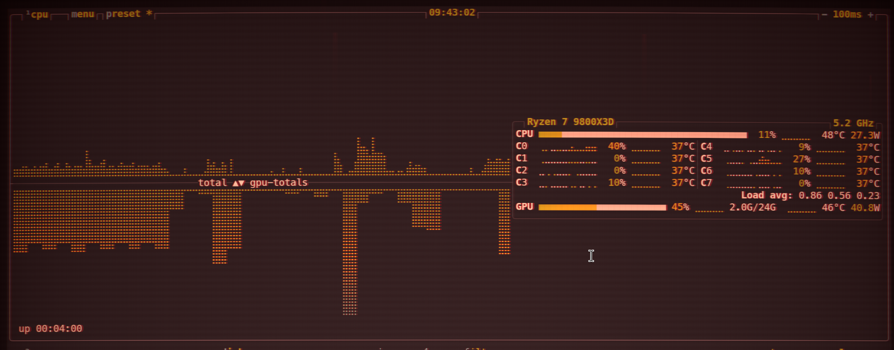

# Ghostty Blackwall Shader

A Cyberpunk 2077 "Deep Breach" inspired shader for [Ghostty](https://ghostty.org/). This shader features high-contrast red UI elements, rare AI breaches, and heavy analog CRT characteristics.



## Features

- **Retro CRT Aesthetics:** Includes scanlines, screen curvature, bloom, and vignette for a vintage terminal feel.
- **Cyberpunk 2077 "Blackwall" Theme:** High-contrast red tint inspired by the Deep Breach UI.
- **Dynamic Glitches:** Dual-cycle glitch system that introduces subtle artifacts and rare "AI breaches."
- **Procedural Background:** Subtle "code snippets" and streamer layers that add depth without being distracting.
- **Chromatic Aberration:** Subtle color fringing that increases towards the screen edges.

## Installation

### Automatic (Recommended)

Run the included installation script to automatically detect the shader path and update your Ghostty config:

```bash
chmod +x install.sh
./install.sh
```

### Manual

1. Copy `blackwall.glsl` to a permanent location on your system.
2. In your Ghostty config (usually `~/.config/ghostty/config`), add or update the following line:

```conf
custom-shader = /path/to/blackwall.glsl
```

## Configuration

You can customize the shader by editing the `#define` constants at the top of `blackwall.glsl`:

| Constant | Default | Description |
|----------|---------|-------------|
| `SCANLINE_INTENSITY` | `0.12` | Strength of the horizontal scanlines. |
| `SCANLINE_COUNT` | `1000.0` | Number of scanlines across the screen. |
| `BLOOM_INTENSITY` | `1.6` | Intensity of the red glow effect. |
| `UI_TINT` | `vec3(1.0, 0.02, 0.05)` | The primary color of the UI/glitches. |
| `CURVATURE` | `0.08` | Amount of CRT screen curvature. |
| `VIGNETTE_STRENGTH` | `0.55` | Darkening of the screen edges. |

## Credits

Inspired by the "Deep Breach" UI from Cyberpunk 2077.
